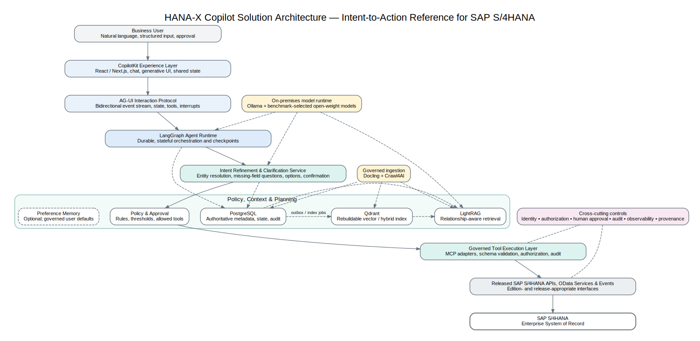
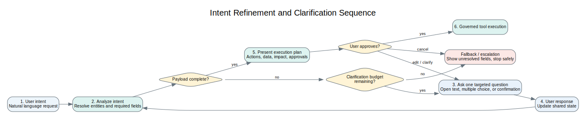
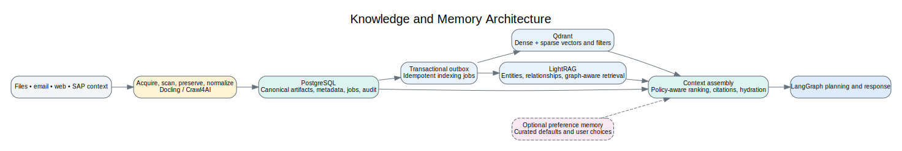
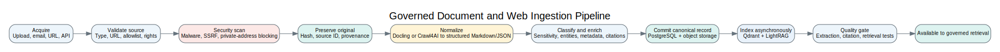
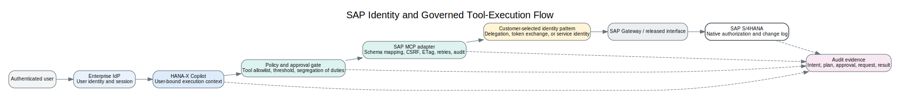

# HANA-X Copilot Solution Architecture

## Intent-to-Action Reference Architecture for SAP S/4HANA

**Artifact:** ICE-ARCH-001  
**Version:** 0.1  
**Status:** IN-REVIEW  
**Date:** 16 July 2026  
**Owner:** HANA-X AI Architecture

> This document is a governed architecture artifact derived from the contextual architecture working record `ICE-SRC-008`. It distinguishes accepted direction, proposed decisions, alternatives, and open questions. Product and technology claims remain subject to the review gates recorded in Project ICE.

## 1. Purpose and scope

HANA-X Copilot is an on-premises, agentic interaction layer for SAP S/4HANA. It allows a business user to express intent in natural language, refine that intent collaboratively, obtain an explainable execution plan, and invoke released SAP interfaces through governed tools. SAP S/4HANA remains the enterprise System of Record; HANA-X Copilot provides the System of Intent that connects human goals to controlled enterprise execution.

This reference architecture defines the baseline solution boundaries for:

- the user experience and bidirectional agent protocol;
- stateful orchestration and human-in-the-loop control;
- intent refinement, clarification, and plan confirmation;
- on-premises model inference through Ollama;
- policy, context, knowledge, and preference memory;
- governed ingestion of files, email content, text, and web sources;
- SAP tool adaptation through Model Context Protocol (MCP);
- integration with released SAP S/4HANA APIs, OData services, and events;
- identity, authorization, audit, observability, and provenance; and
- the design controls needed to preserve a Clean Core-aligned extension model.

The baseline is built first for SAP S/4HANA and is designed so that additional enterprise systems may be integrated through the same governed tool boundary.

## 2. Architecture status vocabulary

| Classification | Meaning |
|---|---|
| **Accepted direction** | Agreed architectural direction for the baseline, pending implementation-level validation where noted. |
| **Proposed decision** | Recommended choice that requires a formal architecture review or proof of concept. |
| **Optional component** | May be enabled for a deployment profile after value, privacy, and operating cost are demonstrated. |
| **Alternative considered** | A credible option retained for context but not selected for the baseline. |
| **Open question** | A dependency, customer-specific choice, or unresolved design matter that must be decided before production use. |

## 3. North-star architecture principle

The architecture follows one governing principle:

> Human intent must never be translated directly into an enterprise write without structured interpretation, policy evaluation, authorization, validation, and an auditable decision path.

That principle creates a deliberate progression:

1. A user expresses intent.
2. The Copilot resolves business entities and required fields.
3. The Copilot asks targeted clarification questions when information is missing or ambiguous.
4. Policy and context are applied.
5. The user sees the proposed plan, relevant data, expected impact, and approval requirement.
6. The system executes only registered tools under the initiating identity and applicable policy.
7. Results, errors, approvals, and evidence are recorded.

## 4. Reference architecture

The solution separates the experience, interaction protocol, orchestration, context, tool execution, and enterprise system layers. This separation prevents the user interface from becoming coupled to a specific model, graph implementation, or SAP service contract.

**Figure ICE-FIG-001 — Enterprise Intent Layer reference architecture**



### 4.1 Layer summary

| Layer | Baseline responsibility | Primary components |
|---|---|---|
| Experience | Natural-language interaction, generative UI, approvals, progress, and shared state | React, Next.js, CopilotKit |
| Agent interaction protocol | Bidirectional event transport for messages, state, tools, interrupts, and lifecycle events | AG-UI |
| Agent runtime | Durable stateful orchestration, checkpoints, routing, retries, and resumability | LangGraph |
| Intent refinement | Entity resolution, missing-field detection, targeted questions, options, and plan confirmation | LangGraph subgraph, local model, validation rules |
| Policy, context, and planning | Rules, SAP/user context, retrieval, ranking, planning, and approval thresholds | Policy service, PostgreSQL, Qdrant, LightRAG, optional preference memory |
| Model runtime | Local inference, structured generation, classification, extraction, and reasoning | Ollama plus benchmark-selected open-weight models |
| Governed tool execution | Tool discovery, schema normalization, authorization, execution controls, error translation, and audit | MCP server/adapters, SAP tool registry |
| SAP integration | Released and supported SAP interfaces appropriate to edition and release | OData, REST APIs, business events, approved integration interfaces |
| System of Record | Authoritative enterprise transactions and SAP authorization enforcement | SAP S/4HANA |
| Cross-cutting controls | Identity, authorization, approval, audit, observability, provenance, retention, and security | Platform services and policy controls |

## 5. Experience layer

### 5.1 Accepted direction: CopilotKit on React and Next.js

CopilotKit is used as the agent-native user-experience framework. The baseline experience includes:

- production conversational interaction;
- streaming responses and execution status;
- generative UI for SAP business objects, comparisons, and approvals;
- user-editable structured inputs;
- shared state between the agent and interface;
- human-in-the-loop confirmation and interruption; and
- reusable interaction patterns for future web, mobile, and enterprise-channel clients.

The frontend does not contain SAP transaction logic. It renders and captures state while the backend owns business interpretation, validation, policy, and execution.

### 5.2 Interaction design requirements

The Copilot should render the form best suited to the decision rather than forcing every step through a free-text chat box. Supported interaction forms include:

- natural-language input;
- multiple-choice selection;
- structured field correction;
- confirmation and approval cards;
- execution-plan review;
- tabular SAP results;
- exception and remediation choices; and
- cancellation or escalation.

## 6. AG-UI interaction protocol

### 6.1 Accepted direction

AG-UI is the protocol boundary between the user-facing application and the agent runtime. It carries structured events for messages, shared state, tool activity, interrupts, approvals, and execution progress.

The protocol boundary allows:

- the frontend to evolve without rewriting the agent graph;
- the orchestration runtime or local model to change without breaking the client;
- tools and state changes to be represented as typed events rather than parsed strings;
- the user to interrupt, cancel, or amend work; and
- future clients to consume the same agent contract.

### 6.2 Control requirement

AG-UI events are transport messages, not authorization decisions. Every event that may cause a state change or tool execution must be revalidated by the backend using the authenticated identity, current graph state, policy, and tool contract.

## 7. LangGraph agent runtime

### 7.1 Accepted direction

LangGraph provides the durable, stateful orchestration runtime. It is responsible for:

- maintaining workflow state across turns;
- routing between interpretation, retrieval, planning, clarification, approval, execution, and response nodes;
- checkpointing before user input or sensitive execution;
- resuming interrupted work safely;
- retrying idempotent operations;
- handling SAP business and technical errors;
- preserving an auditable execution trace; and
- supporting long-running business workflows.

### 7.2 Graph boundaries

The agent graph is divided into explicit subgraphs:

1. **Intent intake and entity resolution**
2. **Clarification and confirmation**
3. **Context retrieval and policy evaluation**
4. **Planning and approval determination**
5. **Governed tool execution**
6. **Result validation and explanation**
7. **Exception handling and escalation**

The runtime must not rely on an unconstrained ReAct loop for high-risk SAP writes. The graph should use explicit routing, typed state, policy nodes, and deterministic validation around model-mediated steps.

## 8. Intent Refinement and Clarification Service

### 8.1 Accepted direction

The former “prompt enhancer” concept is formalized as the **Intent Refinement and Clarification Service**. Its role is not to rewrite prose invisibly. It converts incomplete human intent into a transparent, executable business instruction.

The service performs:

- business intent classification;
- SAP object and entity resolution;
- extraction of candidate values;
- required-field analysis against registered tool schemas;
- ambiguity detection;
- targeted question generation;
- multiple-choice option generation from governed data;
- confidence and risk assessment;
- clarification-budget enforcement; and
- final plan presentation.

### 8.2 Clarification policy

The baseline supports up to three sequential clarification questions for a single planning cycle. The limit is a policy default, not an absolute product constraint. A deployment may configure the budget by process risk and user experience.

Questions should be ordered by information value. The service asks one targeted question at a time when doing so reduces ambiguity. Multiple-choice options must be derived from authorized sources or validated tool results; they must not be invented by the model.

**Figure ICE-FIG-006 — Intent refinement and clarification sequence**



### 8.3 Safe fallback

If the clarification budget is exhausted, required fields remain unresolved, or the user rejects the plan, the workflow must stop safely. It may:

- show the unresolved fields;
- offer a search or dashboard alternative;
- save a draft;
- route to a human specialist; or
- cancel the workflow.

It must not substitute model guesses for required enterprise values.

## 9. On-premises model runtime

### 9.1 Accepted direction: Ollama

Ollama provides the on-premises model-serving boundary. The architecture remains model agnostic: a model is selected through versioned benchmarks rather than embedded permanently in business logic.

Evaluation dimensions include:

- SAP entity and field extraction;
- tool-selection accuracy;
- schema adherence;
- clarification quality;
- multilingual performance;
- instruction following;
- reasoning on business exceptions;
- latency and throughput;
- memory and accelerator requirements; and
- safety under adversarial or ambiguous inputs.

### 9.2 Structured output controls

Schema-constrained generation reduces malformed output risk but does not guarantee business correctness. Every model-generated object remains subject to:

- Pydantic or equivalent structural validation;
- SAP metadata and code-list validation;
- tool-specific business validation;
- policy and authorization checks;
- concurrency and version checks; and
- human approval where required.

The architecture must not describe `temperature=0` as absolute determinism or structured output as “zero hallucination.”

### 9.3 Model isolation

The model runtime receives only the minimum context required for the current step. Secrets, raw access tokens, and unrestricted enterprise records must not be placed in model prompts. Tool credentials remain outside the model boundary.

## 10. Policy, context, and planning layer

This layer converts refined intent and authorized context into an executable plan.

### 10.1 Policy service

The policy service evaluates:

- permitted tools and operations;
- financial and operational thresholds;
- required approver roles;
- restricted suppliers, materials, plants, or company codes;
- data-classification rules;
- segregation-of-duties constraints;
- environment restrictions;
- user confirmation requirements; and
- whether the workflow may proceed automatically, must pause, or must be denied.

Policy decisions are explicit records and are not delegated solely to an LLM.

### 10.2 Planning

A plan contains:

- intended business outcome;
- resolved business entities;
- tool sequence and dependencies;
- data to be read or changed;
- expected impact;
- policy and approval requirements;
- rollback or compensation behavior where applicable;
- idempotency strategy; and
- user-facing explanation.

The planner may use a model to propose a plan, but a deterministic validator must verify that every step maps to a registered tool and allowed operation.

## 11. Knowledge, context, and memory architecture

### 11.1 Accepted responsibilities

| Component | Responsibility |
|---|---|
| PostgreSQL | Authoritative record for normalized artifacts, metadata, graph state, conversations, jobs, policies, audit evidence, entities, and indexing status |
| Governed object storage or filesystem | Immutable original binary files |
| Qdrant | Rebuildable vector and hybrid retrieval index with metadata filters |
| LightRAG | Relationship-aware retrieval and graph-assisted context assembly, subject to a validated storage configuration |
| LangGraph checkpointer | Active workflow state and resumable execution |
| Optional preference memory | Curated user defaults and recurring choices after explicit policy and value review |
| SAP S/4HANA | Authoritative enterprise transactions and business authorization |

### 11.2 Transactional outbox pattern

PostgreSQL and Qdrant do not participate in one ordinary atomic transaction. The ingestion design therefore uses a transactional outbox:

1. Preserve the original and write the canonical artifact, metadata, and indexing job to PostgreSQL.
2. Commit the PostgreSQL transaction.
3. Publish or poll the outbox record.
4. An idempotent worker chunks, embeds, and writes points to Qdrant.
5. The worker records success, failure, retries, model version, and vector version.
6. A reconciliation process detects missing, stale, or orphaned index records.

Qdrant and graph indexes must be rebuildable from canonical records.

**Figure ICE-FIG-007 — Knowledge and memory architecture**



### 11.3 Retrieval pipeline

Retrieval combines:

- exact relational and temporal filters;
- dense semantic similarity;
- sparse or lexical matching for identifiers and part numbers;
- relationship-aware expansion;
- policy-aware ranking;
- provenance and citation preservation; and
- hydration of full canonical records only when required.

Retrieved context is treated as untrusted input and must not override system policy or tool authorization.

### 11.4 Personal workspace profile

The “second brain” concept is retained as a **Personal Context and Knowledge Layer** deployment profile. Even for a single user, the design preserves identity, data ownership, deletion, retention, encryption, authorization, and audit controls because the Copilot may access or change enterprise data.

## 12. Governed ingestion

### 12.1 Document ingestion with Docling

Docling is the baseline normalization engine for uploaded documents and supported local content. It preserves document structure and produces normalized Markdown or JSON suitable for retrieval and extraction.

The ingestion pipeline is:

```text
Acquire → Validate → Scan → Preserve original → Normalize → Classify
→ Extract metadata and entities → Chunk → Index → Quality-check → Publish for retrieval
```

SAP documents containing tables require explicit table-quality checks. A normalized table is not assumed correct solely because it was parsed successfully.

### 12.2 Web acquisition with Crawl4AI

Crawl4AI is the proposed web-acquisition component. Its use is governed by:

- domain allowlists and denylists;
- SSRF and private-address blocking;
- authentication-secret isolation;
- robots, terms-of-service, and licensing policy;
- content provenance, URL, timestamp, and page hash;
- refresh, expiration, and deletion rules;
- user approval before permanent ingestion; and
- extraction-quality checks.

The architecture describes compliant browser automation, not bot-detection bypass.

**Figure ICE-FIG-008 — Governed document and web ingestion**



## 13. Preference memory

A preference-memory service such as Mem0 is optional for the baseline. The initial implementation should use explicit PostgreSQL tables for user defaults and preferences because they provide transparent ownership, conflict handling, deletion, and audit behavior.

A specialized memory service may be introduced only after a benchmark demonstrates material improvement in:

- fact extraction;
- conflicting-memory resolution;
- retrieval relevance;
- user correction and deletion;
- privacy controls;
- local model and embedding configuration; and
- operational simplicity.

No preference may silently override an SAP-required value, current authorized data, or an approval rule. The user must be able to inspect and correct remembered preferences.

## 14. Governed tool execution and MCP

### 14.1 Accepted direction

MCP provides the adaptation boundary between the agent runtime and enterprise tools. For SAP, the MCP layer is more than a thin HTTP wrapper. It performs:

- tool discovery and registration;
- SAP metadata and schema mapping;
- parameter normalization;
- user and policy context enforcement;
- input validation;
- approval gating;
- CSRF token and session handling where required;
- ETag and optimistic concurrency handling;
- idempotency and duplicate-prevention controls;
- retry and backoff for safe operations;
- SAP error normalization;
- response minimization and redaction;
- rate limiting; and
- audit evidence generation.

### 14.2 Tool contract

Every tool must declare:

- permanent tool ID and version;
- business purpose;
- SAP service and entity mapping;
- supported editions and releases;
- input and output schema;
- read/write classification;
- required authorization context;
- policy and approval requirements;
- idempotency behavior;
- expected errors and remediation guidance;
- audit fields; and
- deprecation status.

The model may select from registered tools but may not construct arbitrary SAP URLs.

## 15. SAP integration and Clean Core alignment

### 15.1 Interface strategy

HANA-X Copilot integrates through released and supported SAP S/4HANA APIs, OData services, business events, and other approved interfaces appropriate to the customer’s edition and release.

This preserves a Clean Core-aligned extension strategy by:

- avoiding direct database access;
- avoiding intrusive modification of the ERP core;
- isolating Copilot logic outside S/4HANA;
- using versioned and governed integration contracts;
- maintaining an endpoint compatibility matrix; and
- treating custom APIs as separately governed extensions.

### 15.2 Endpoint-first development

SAP endpoint contracts inform:

- the tool registry;
- required business fields;
- clarification questions;
- validation rules;
- error handling;
- supported business processes; and
- acceptance tests.

The first complete domain mapping is procurement, including purchase requisitions, purchase orders, suppliers, products, stock, inbound deliveries, and supplier invoices.

## 16. Identity, authorization, and principal propagation

Authentication and principal propagation vary by S/4HANA edition, identity provider, network topology, SAP Gateway configuration, and customer policy. The product therefore supports patterns rather than assuming one universal flow.

### 16.1 Supported pattern families

| Pattern | Use |
|---|---|
| Direct on-premises user delegation | Copilot services run inside the trusted enterprise network and propagate a mapped user context to SAP |
| OAuth 2.0 user-bound access | SAP and the customer identity platform support a delegated OAuth pattern |
| SAML bearer or token exchange | A trusted identity assertion is exchanged for an SAP access token where supported |
| Service identity with compensating controls | Limited scenarios where user delegation is unavailable; requires explicit policy, attribution, and restricted scope |
| Customer-selected BTP/Cloud Connector pattern | Optional integration when the customer elects to use SAP BTP services |

Each deployment must document identity mapping, token lifetime, revocation, secrets, audit attribution, fallback, and failure behavior.

**Figure ICE-FIG-009 — SAP identity and tool-execution flow**



## 17. Human-in-the-loop governance

Human approval is policy driven. It is not merely an optional UI feature.

The baseline distinguishes:

- **informational actions** — no approval, provided access is authorized;
- **low-risk drafts** — user confirmation before saving a draft;
- **reversible operational changes** — confirmation or designated approval by policy;
- **financial, compliance, or high-impact writes** — explicit approver identity and recorded authorization;
- **ambiguous or unsupported actions** — stop and escalate.

The approval record includes the plan version, payload digest, data shown to the approver, policy result, approver identity, time, and execution result. A changed payload invalidates the prior approval.

## 18. Observability and audit

Every workflow emits a trace that can answer:

- Who initiated the request?
- What business intent was recognized?
- What clarifications were asked and answered?
- What context and sources were used?
- What plan and policy decision were produced?
- Which tools and SAP interfaces were invoked?
- What payload version was approved?
- What did SAP return?
- What retries, errors, or compensating actions occurred?
- What answer was shown to the user?

Logs must avoid secrets and minimize sensitive business data. Trace IDs link user-visible execution status to backend evidence without exposing raw tokens or credentials.

## 19. Deployment baseline

The reference deployment is on premises and containerized. A baseline topology contains:

- Next.js/CopilotKit frontend;
- AG-UI-compatible agent gateway;
- LangGraph runtime and checkpointer;
- Ollama model runtime;
- policy and approval service;
- PostgreSQL;
- Qdrant;
- optional LightRAG and preference-memory services;
- Docling and Crawl4AI ingestion workers;
- SAP MCP tool service;
- object storage or governed filesystem;
- secrets management;
- centralized logs, metrics, and traces; and
- reverse proxy/API gateway.

Production deployments require separate development, test, and production configuration, model and prompt versioning, backup and recovery, capacity tests, and rollback procedures.

## 20. Architecture decision summary

| Decision area | Baseline status | Decision record |
|---|---|---|
| Public canonical repository with owner-authorized source corpus | Accepted by owner | ADR-004 |
| CopilotKit and AG-UI experience architecture | Proposed | ADR-005 |
| LangGraph stateful orchestration | Proposed | ADR-006 |
| Intent Refinement and Clarification Service | Proposed | ADR-007 |
| Ollama on-premises model runtime | Proposed | ADR-008 |
| MCP boundary for SAP tools | Proposed | ADR-009 |
| PostgreSQL/Qdrant transactional outbox | Proposed | ADR-010 |
| LightRAG relationship-aware retrieval | Proposed | ADR-011 |
| Docling normalization | Proposed | ADR-012 |
| Crawl4AI governed web acquisition | Proposed | ADR-013 |
| Optional preference-memory strategy | Proposed | ADR-014 |
| SAP identity and principal-propagation patterns | Proposed | ADR-015 |

## 21. Open questions and required proofs

Before production approval, the architecture requires:

1. A benchmark-selected local model and embedding model for the target hardware.
2. An SAP edition and release compatibility matrix.
3. A validated identity and principal-propagation pattern for each deployment profile.
4. A procurement endpoint and tool-contract catalog with test evidence.
5. A LightRAG storage and deletion design that avoids uncontrolled duplication.
6. A decision on whether preference memory remains native to PostgreSQL or uses an additional service.
7. Retrieval-quality, document-extraction, and web-ingestion evaluation datasets.
8. Capacity, latency, recovery, and concurrency tests.
9. Security threat modeling for prompts, tools, ingestion, SSRF, data exfiltration, and authorization bypass.
10. Evidence and legal review for externally published market, licensing, and SAP architecture claims.

## 22. Derived requirements

The architecture generates traceable requirements recorded in `ICE-ARCH-001_Derived-Requirements_v0.1.csv`. Representative requirements include:

- The Copilot shall ask targeted questions when required business fields are missing or ambiguous.
- The Copilot shall support open-text, multiple-choice, correction, confirmation, and approval interactions.
- SAP write actions shall execute only through registered, versioned, and authorized tools.
- The system shall preserve the initiating identity and applicable SAP authorization context.
- PostgreSQL shall remain authoritative for ingestion and indexing state.
- Vector and graph indexes shall be rebuildable.
- Model output shall pass structural, business, policy, authorization, and approval validation.
- Every SAP write shall produce a traceable execution and approval record.

## 23. Submitted diagram disposition

The submitted solution-architecture diagram is preserved unchanged as design provenance under the `ICE-FIG-001` source directory. It communicates the intended product stack effectively, including CopilotKit, AG-UI, LangGraph, intent refinement, PostgreSQL, Qdrant, LightRAG, optional preference memory, MCP, SAP interfaces, and Clean Core.

The governed `ICE-FIG-001` version refines the concept by:

- separating CopilotKit and AG-UI into distinct layers;
- positioning Ollama as the model runtime rather than a side-channel;
- treating human approval as a cross-cutting policy control;
- adding governed Docling and Crawl4AI ingestion;
- distinguishing authoritative PostgreSQL records from rebuildable Qdrant indexes;
- labeling preference memory as optional;
- adding identity, authorization, audit, observability, and provenance controls;
- qualifying SAP interfaces by edition and release; and
- omitting the SAP logo from the governed render pending brand and publication review.

## 24. References

The governed reference catalog is maintained in `References/ICE-ARCH-001_References.md`. The primary technical references are official documentation for CopilotKit, AG-UI, LangGraph, MCP, Ollama, Qdrant, Docling, Crawl4AI, LightRAG, Mem0, SAP Clean Core, and SAP S/4HANA.

---

**Review status:** This artifact is suitable for architecture review and requirements extraction. It is not an approved production design until the Project ICE technical, SAP integration, security, source, and executive review gates are complete.
